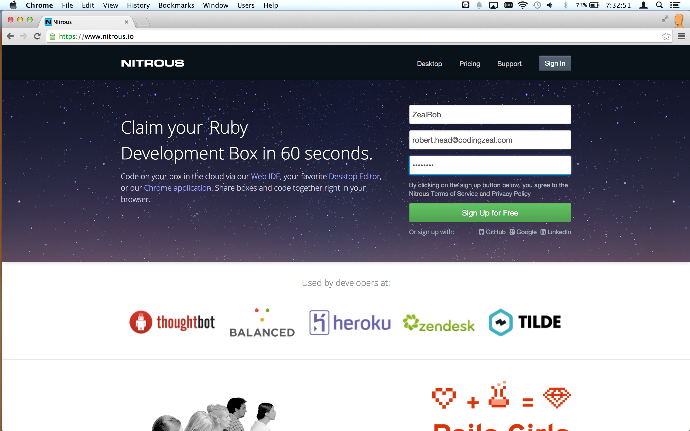
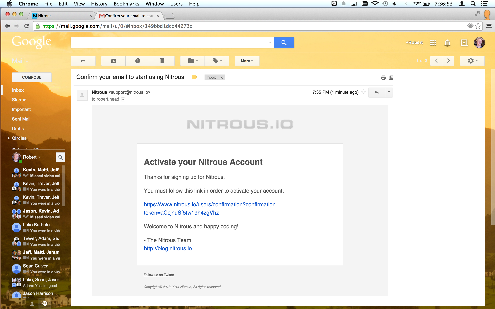
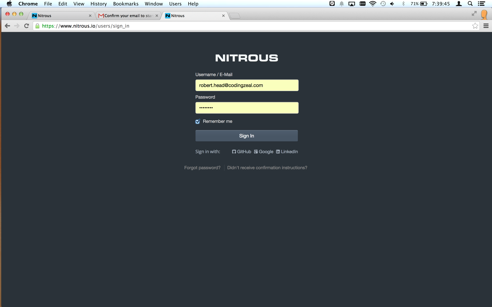
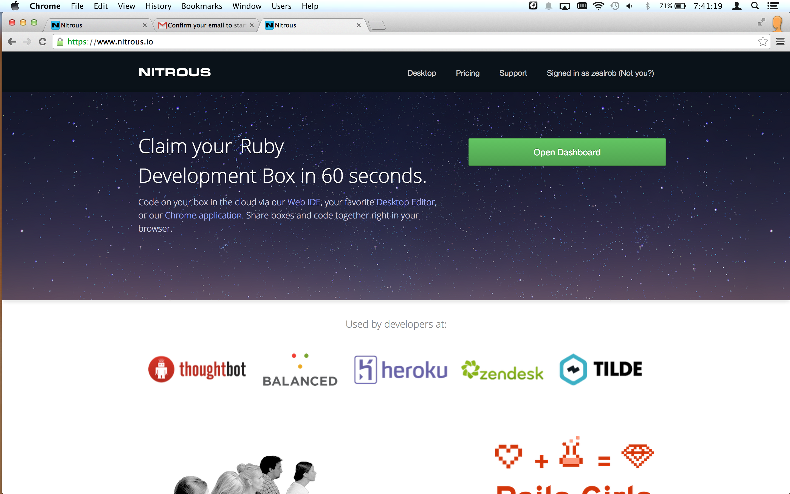
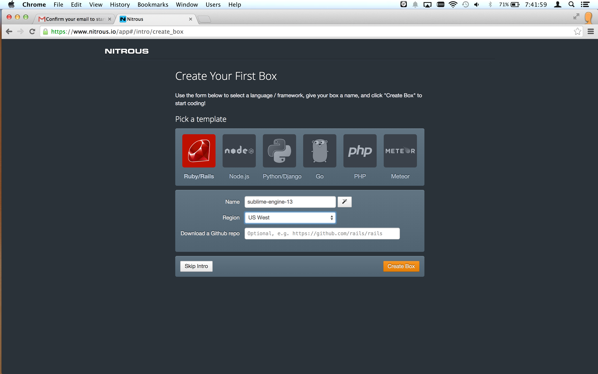
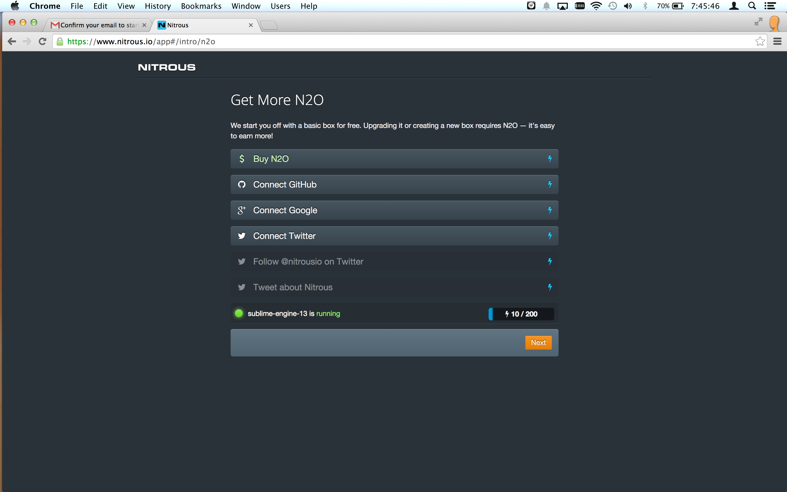
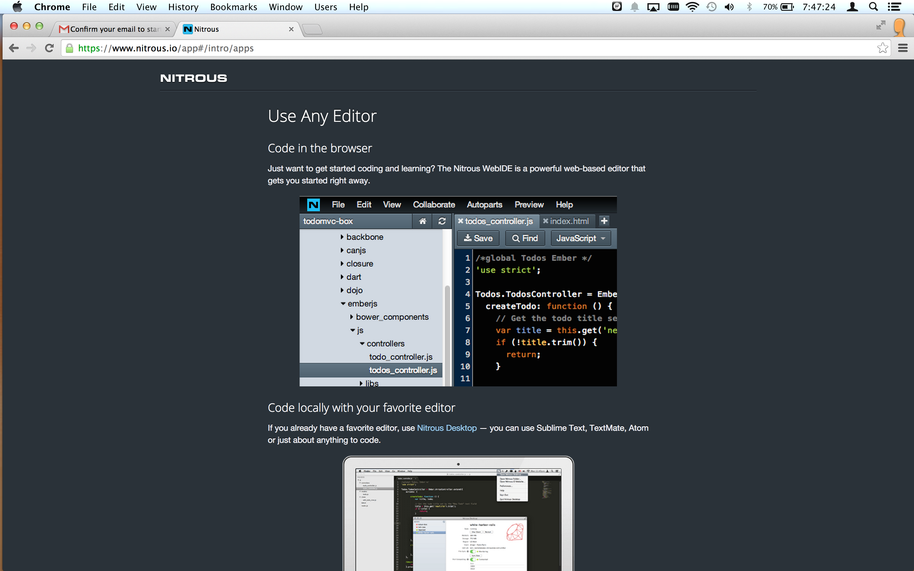
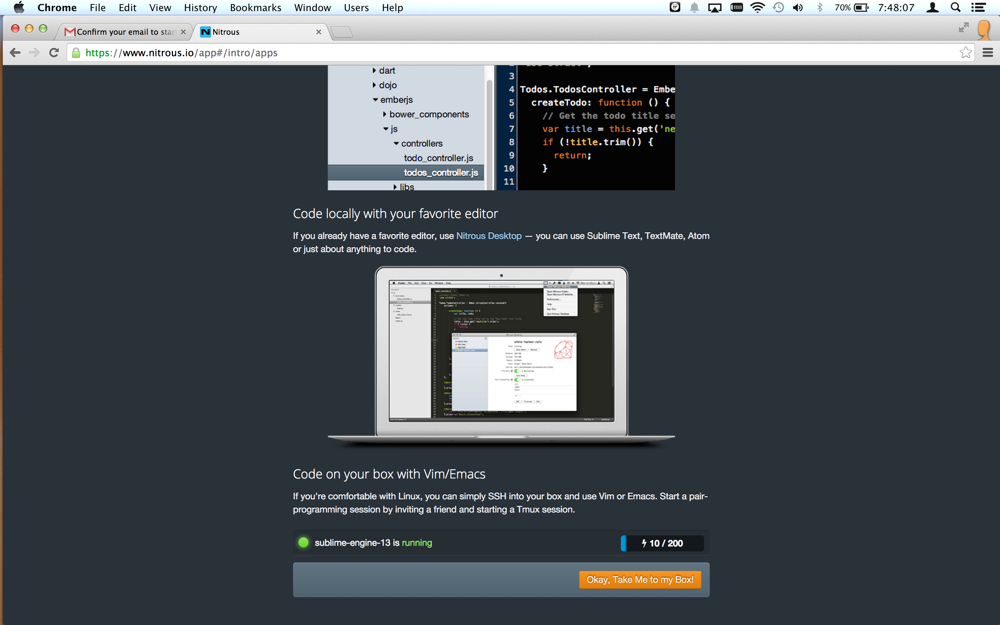
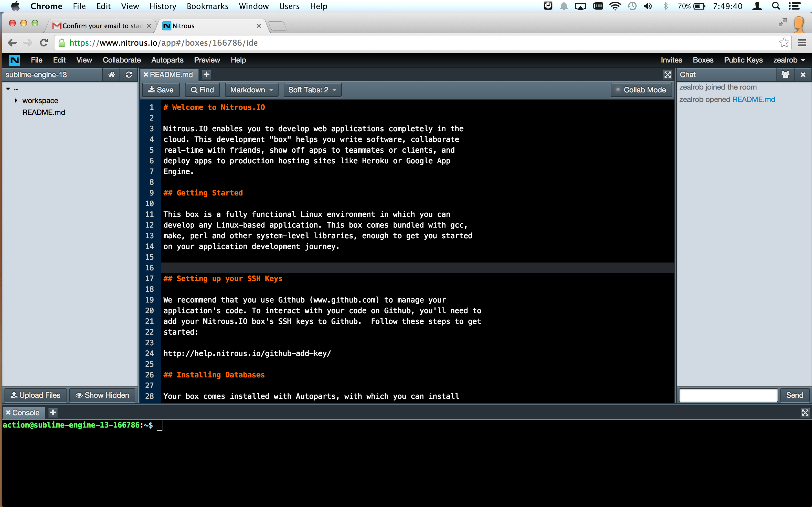
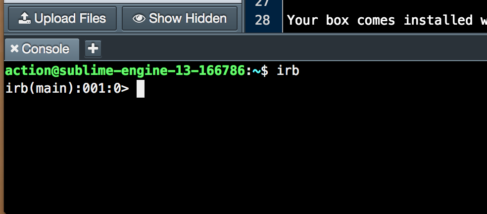

# Ruby on Rails Workshop

Southern Oregon University  
Robert Head  
Co-founder, codingzeal.com  
Presented: Nov 14, 2014

## Getting Set Up

Getting _ruby_ and _Ruby on Rails_ set up on a new workstation can take some effort, especially on a Windows box. But if it hurts, we're probably doing it wrong, so let's do it the modern way, in the cloud!

Visit http://nitrous.io in a web browser

Fill out the sign up form ad click "Sign Up for Free"

Confirm your account via your email

Sign In

Click "Open Dashboard" from the homepage

Fill out the "Create Your First Box" form and click "Create Box"

Wait for the box to provision and start. Then, click "Next"

Read the introduction to Nitrous editing options and click "Okay, Take Me to my Box!"

You are now in the IDE (Integrated Development Environment) for the box.

Explore...

The IDE has the file structure on the left, a text editor in the middle, and a command-line terminal on the bottom. Everything we need!

- - -

## Introduction to Ruby

**Ruby** is a dynamic, reflective, object-oriented, general-purpose programming language. It was designed and developed in the mid-1990s by Yukihiro "Matz" Matsumoto in Japan.

The "killer app" for ruby has been rapidly developing Web applications in the Ruby on Rails framework.

### irb (interactive ruby shell)

Interactive Ruby Shell (irb) is a REPL (read-eval-print loop) console for programming in ruby.

From the command line at the bottom of your nitrous IDE:

    irb

#### Use irb as a calculator

Every expression in ruby evaluates to a value.

Jump right in and write some numerical expressions. For example:

    5 + 9
    5 - 7
    5 * 9
    5 / 3

Quirky! Integer division. Let's experiment...

    5 / 3.0
    5.0 / 3
    5 % 3

Exponent syntax

    5**3

#### Calling Methods

In ruby, we call methods (functions) by appending a dot and the method name to an object like `object.method`

##### Method naming style

Method names are typically "snake case" (lower-case words separated by underscores. For example, `this_is_snake_case`)

Methods that return a boolean value usually have a question mark at the end.

    -99.abs
    57.even?
    57.odd?

#### Strings

    "Some text"
    "fiz" + "bin"
    puts "fiz" + "bin"
    puts "Deep Space " + 9

Why did this fail?

    puts "Deep Space " + "9"

That's better.

Strings can be single-quoted or double-quoted. Double-quoted strings "interpolate" ruby expressions inserted with the #{} syntax.

    'This will print just like it looks #{ 1 + 1 }'
    "Ten plus eight is #{ 10 + 8 }"

You can put any ruby expression you'd like inside #{} and it will insert the result as a String.

#### Symbols

Symbols are string-like singleton objects, mostly useful as Hash keys. We'll get to Hashes soon!

We'll check the object_id to see that a given symbol, unlike a string, is always the same object in memory.

Style note: symbols are typically lower snake case, just like method names.

    :a
    :a.to_s
    "a".object_id
    "a".object_id
    "a".object_id
    :a.object_id
    :a.object_id

#### Variables

Variables are typically snake case as well.

Assignment is done with a single equals sign.

    x = 99
    x / 9
    y = "foo"
    z = "bar"
    coder_nonsense = y + z

#### More about methods

Almost everything in ruby is an object and responds to method calls. For example, every object responds to the 'class' method, which tells us what *type* the object is.

    53.class
    3.14.class
    "Salad".class
    :foo.class

Some methods have an exclamation point at the end of the name. By ruby convention, the ! usually indicates that it is dangerous or that it modifies the object. For example:

    s = "This is a String"
    s.upcase
    s
    s.update!
    s

#### Arrays

    list = [42, 17, 23]

Accessing an element by index:

    list[0]
    list[1]
    list[2]
    list[3]
    list[-1]
    list[-2]

Some methods

    list.first
    list.last
    list.length
    list.sort
    list.sort.first
    list.class

#### Even more about methods

Some methods accept or require one or more arguments. Let's call the join method on an Array object:

    ["Deep Space", 9].join
    ["Deep Space", 9].join(' ')

Parentheses are optional if the code is unambiguous without them.

    ["Deep Space", 9].join ' '

Want a crazy peek behind the curtain? Operators are actually just "syntactic sugar" for calling methods!

    5.+(4)
    51.* 3

##### Hashes

A Hash is also known as a Dictionary or an Associative Array in other languages. It collects key-value pairs.

    { :a => 1, :b => 2 }

Speaking ruby: The => symbol is called a "hash rocket"

Alternative syntax (looks exactly like JSON / Javascript)

    { a: 1, b: 2 }

Often the keys are symbols, but both the key and value can be any object

    { 'foo' => 45, 99 => 'baz' }

Hash values are accessed by key, similar to getting an Array element at a given index.

    h = { :name => "Jennifer Lawrence", :nickname => "J-Law", :known_for => "Hunger Games" }
    h[:name]
    h[:known_for]

However, Hashes are unordered, so you can't access them by index like you would for an Array.

    h[0]

...returns `nil` because there is no key 0.

##### Ranges

    r = 1..99
    r.include?(0)
    r.include?(1)
    r.include?(5)
    r.include?(5.5)
    r.include?(99)
    r.include?(99.1)
    r.to_a

#### Conditionals and Flow

    5 == 3
    1 == 1.0
    "1" == 1

Let's put things together.

    x = rand(100)
    if x.odd?
      puts "#{x} is odd"
    else
      puts "#{x} is even"
    end

Confusify!

    puts "#{x = rand(100)} is #{x.odd? ? 'odd' : 'even'}"

Notice that we can do assignment inside interpolated expression within a String. Not readable, but shows very pithy!

#### Looping and Blocks

    list = (0..10).to_a

Familiar syntax for newbies:

    for n in list
      puts n
    end

The ruby way to do something with each element of an Array:

    list.each do |n|
      puts n
    end

We put the behavior in a *block*, surrounded by do; end.

One-line blocks often use curly brace syntax instead of `do` and `end`

    list.each { |n| puts n }

There are other iterators. For example, `map` collects the results of the block

    squares = list.map { |n| n**2 }

####  Defining your own Classes

Ruby is an object-oriented language, so naturally we want to write our own classes.

We define a **class** with the `class` keyword.

An **instance** of a class will store data in **instance variables**, which have names that are are prefixed with `@`

A class defines the behavior of its instances in **methods**. Methods are defined using the `def` keyword. A method named "initialize", if defined, will be called automatically when an object is created.

    class Animal
      def initialize(name, noise)
        @name = name
        @noise = noise
      end
    end

    cat = Animal.new('Cat', 'Mrew!')
    cat.speak  # raises an exception because we didn't define this method

Notice the comment? Single-line comments start with a `#`

Want to add more functionality to the class? You can reopen any class any time!

    class Animal
      def speak
        puts "The #{@name.downcase} says '#{@noise}'"
      end
    end

    cat.speak

Even the existing object picked up the new behavior.

##### Inheritance

If you don't specify, a ruby class inherits from the Object class. To define your own, use `<` in the class definition.

    class Dog < Animal
      def initialize
        super("Dog", "Woof!")
      end
    end

    dog = Dog.new
    dog.speak

##### Mixing Modules into a Class

Ruby has a singly-rooted inheritance hierarchy. If we want to "inherit" behavior from more than one place, we can organize behavior into modules.

Module are defined using, you guessed it, the `module` keyword. Inside the module, we can define methods just like inside a class.

    module Feedable
      def feed
        puts "The #{@name.downcase} eats. Grawm nom nom!"
      end
    end

    module Domesticated
      def pet
        puts "Aww, yeah. Right there... That's the spot."
      end
    end

    dog.eat

    class Animal
      include Feedable
    end

    class Dog
      include Domesticated
    end

    dog.feed
    dog.pet

    cat.feed
    cat.pet     # raises exception

You'll rarely see this, but we can even define a method directly on the cat object itself:

    def cat.pet
      puts "Aww, yeah. That's the sp... I WILL CUT YOU!!!"
    end

    cat.pet
    dog.pet

Neat. We're done with irb for now.

    exit

### Ruby Resources

Programming Ruby, a.k.a. the "Pickaxe" Book:
http://ruby-doc.com/docs/ProgrammingRuby/

Ruby for new coders:
https://pine.fm/LearnToProgram/

Ruby for the insane:
http://mislav.uniqpath.com/poignant-guide/

Searchable documentation for the ruby language
http://apidock.com/ruby

Get a head start doing _anything_ using 'ruby gems':
https://www.ruby-toolbox.com/

- - -

## Introduction to Ruby on Rails

**Ruby on Rails**, or simply **Rails**, is an open source web application framework written in Ruby.

Rails is a full-stack framework that emphasizes the use of well-known software engineering patterns and paradigms, including _convention over configuration_ (CoC), _don't repeat yourself_ (DRY), the _active record_ pattern, and the _model–view–controller_ (MVC) pattern.

### Creating a new Rails web application

From the nitrous.io IDE command-line console:

    cd workspace

    rails new blog

    cd blog

    rails server

Select menu item: Preview > Port 3000

Preview your Rails app!

Switch back to the browser tab with the IDE.

Take a little tour of the structure of the project.

  app/controllers
  app/models
  app/views
  config/
  db/

### Git

We've got the application running, so let's commit the code to a local git repository.

First, add a new tab in the console area of the IDE:

Get back to our working directory:

    cd /workspace/blog

Now let's configure git, replacing John Doe with your own name and email address.

    git config --global user.name "John Doe"
    git config --global user.email johndoe@example.com

Initialize the repository.

    git init

Now let's make our first commit!

    git add .
    git commit -m "Initial commit"

### User Stories

**User stories** are one way of defining what we want our application to do.

http://en.wikipedia.org/wiki/User_story

Let's make a blog!

#### User Story #1: Creating Content

IN ORDER TO provide content for our readers
AS bloggers
WE WANT to enter posts

From our command line console:

    rails generate model Post header body:text

On the left side, look inside db/migrate/

It probably already exists, but let's ensure that the database is created using the `rake` utility.

    rake db:create

Now let's run the migration that the generator created.

    rake db:migrate

On the left side of the IDE, close and reopen the db directory to refresh its contents.

Click on schema.rb and read the file. The schema file explains the structure of your database, which now includes a `posts` table. Notice that it has the columns we asked for, plus `created_at` and `updated_at`. An integer `id` column is also implied, but not shown in the schema file.

Let's open a "rails console". It's just like irb, except we are in the context of our application.

    rails console

From inside the rails console, we can initialize and save a post

    post = Post.new
    post.header = "Stay hungry. Stay foolish."
    post.body = "The people who are crazy enough to think they can change the world are the ones who do."
    post.save

Check that it's in the database:

    Post.count

Now let's make a web-based interface that non-coders can use to make blog posts.

Visit http://ruby-toolbox.com in a new browser tab.

Ruby Toolbox is a resource for finding **ruby gems**, which are libraries that provide functionality. We want an "admin interface" we can use to manage our data. Look around in the Rails Admin Interfaces category. We'll choose the `rails_admin` gem.

`rails_admin` is a **Rails Engine**, which is like a whole rails application that we can embed in our own.

In the IDE, open the file called `Gemfile` (it's in the root directory of the project)

The github page for the Rails Admin gem has the installation instructions. https://github.com/sferik/rails_admin#installation

Add this line at the bottom of your Gemfile and save the file.

    gem 'rails_admin'

From the command line:

    bundle

    rails generate rails_admin:install

In the browser tab where you are previewing your application, add /admin to the end of the URL.

We get an error. This is because we need to restart our application whenever we add gems or change a configuration.

Switch back to the IDE browser tab. Switch to the console that has the application running. Hit Control-c to stop the server, then start it again:

    rails server

Now switch back to the preview browser tab and reload the /admin page.

We have a whole admin area where we can create and manage Posts. Go ahead and figure out how to create a post or two.

Switch to the console with the available command prompt.

Review what we've changed.

    git status
    git diff

Our story is complete, so let's commit the changes!

    git add .
    git commit -am "Empower blogger to manage posts"

To review, we:

- created a `Post` model with `rails generate`
- ran a couple of `rake` tasks to create the database table
- added the `rails_admin` gem to our project (the only line of code we wrote ourselves)
- re-bundled our gems
- ran a rake task to finish installing `rails_admin`
- restarted the server
- committed our changes to the repository

And we now have a functioning admin system from which we can create and manage content. Boom.

#### User Story #2: Reading Content

IN ORDER TO enjoy the content
AS readers
WE WANT to see blog posts

We want visitors to be able to go to homepage and view posts. Let's sketch out our solution. Ruby on Rails implements the Model-View-Controller paradigm. So, for our task, we need to:

1. Map the root URL of our site `/` to a controller method, called an **action**
2. Gather the necessary data from the database in the controller action
3. Write some ruby-infused HTML for the view

From the command line:

    rails generate controller posts index

Open `app/controllers/posts_controller.rb`

We've generated a Controller class with a method called `index`, which is, by convention, the action that will return a collection of objects to the user.

Now open /config/routes

The line `get 'posts/index'` was added by the rails generate command we just ran. It would map the `/posts` URL to our new action. We want to map the homepage there instead, so delete that line and add:

    root to: "posts#index"

This means "Route requests for the homepage to index action of the posts controller".

Visit or reload the preview page in your browser.

Sort of works already. By rails convention, the controller action renders the corresponding view template. And the view template, which was also generated by `rails generate`, tells us where to find it.

Before we edit the view template, we're going to need some data, so let's fetch it in the controller action.

Back in the Nitrous IDE, open `app/controllers/posts_controller.rb` and let's fetch the data inside the action method definition.

    @posts = Post.order("created_at DESC").all

Now let's go edit that view file and change it something like:

    <h1>My Blog</h1>

    <% @posts.each do |post| %>
      <h2><%= post.header %></h2>
      
<%= post.created_at %>

      
<%= post.body %>

    <% end %>

Switch to the preview tab and reload the page.

It's working, so let's review and commit our changes.

    git status
    git diff
    git add .
    git commit -m "Enable viewing of posts"

To review, we:

- generated a new controller, action, and view for posts
- routed the homepage to the controller action
- fetched data in our controller action
- presented that data in our view template
- committed our changes to the repository

#### User Story #3: Logging in

Now that we have a working blog, we have a problem. Anyone can access the `/admin` area. To secure our site, we'll need an authentication (login) system and an authorization (permissions) system.

Let's start with a log in system.

IN ORDER TO enable access control
AS legitimate bloggers
WE WANT to log in with a password

We'll start with a User model, backed by a `users` table in the database.

From the command line console:

    rails generate model User name

Refresh the `db/migrations/` folder in the IDE's file navigator. Notice that the generator created a migration for creating the `users` table.

We don't need to edit the migration, let's just run it:

    rake db:migrate

Check out the updates in `db/schema.rb`

Now visit https://www.ruby-toolbox.com/ and look up 'authentication'

We'll choose `devise`. It's another rails engine, just like `rails_admin`.

Go to the github page for devise at https://github.com/plataformatec/devise

In the IDE, open the Gemfile and add to the bottom.

    gem 'devise'

From the console, bundle our gems.

    bundle

Next, we complete the installation according to the devise instructions.

    rails generate devise:install

During sign up, log in, and other times, devise generates certain messages that need to appear on the page, so we'll make the necessary space for them on our pages. Open `app/views/layouts/application.html.erb`, add these lines inside the body of the page, and save the file.

    
<%= notice %>

    
<%= alert %>

According to the devise instructions, now we need to run a generator that upgrades the model that will be used for authentication.

    rails generate devise User

Now we just need to run the new migration.

    rake db:migrate

Now look in `db/schema.rb` and see all the new columns in the users table.

Devise will want to send emails for sign up confirmation, password reset, and other purposes. In `config/environments/development.rb`, add this configuration inside the block.

    config.action_mailer.default_url_options = { host: 'localhost', port: 3000 }

Now we're going to figure out how to require log in for the admin section.

In config/initializers/rails_admin.rb, uncomment the lines that activate Devise.

    # == Devise ==
    config.authenticate_with do
      warden.authenticate! scope: :user
    end
    config.current_user_method(&:current_user)

We changed a configuration, so we need to restart the server.

    [control-C]
    rails server

Preview our application at /admin

The request redirected to the sign in page, with a notice at the top.

Now open app/views/layouts/application.html.erb and add 'sign in', 'sign out', and 'sign up' links to the layout.

    

      <% if current_user %>
        Welcome, <%= current_user.name %>.
        <%= link_to "Sign Out", destroy_user_session_path, { method: 'delete' } %>
      <% else %>
        <%= link_to "Sign In", new_user_session_path %>
        <%= link_to "Sign Up", new_user_registration_path %>
      <% end %>
    

Using the site, create a new user account and sign in.

We have a working authentication system, so let's commit our changes!

    git add .
    git commit -m "Add log in"

In review, to create an authentication system, we:

- generated the User model and table
- installed the `devise` gem
- add a place for notice and alert messages in our view layout
- configured rails_admin to recognize devise users
- restarted the server
- added links for sign in, sign out, and sign up
- committed our changes to the repository

#### User Story #4: Access Control

We've got a new problem. Anyone who signs up gains access to the admin area. We need authorization.

IN ORDER TO protect the content
AS bloggers
WE WANT to restrict access to admins

First, we'll add an admin flag to the users table.

    rails generate migration add_admin_to_users admin:boolean
    rake db:migrate

Jump into a console.

    rails console

Now make the most recently added user an admin.

    User.last.update_attribute(:admin, true)
    exit

Now let's restrict access to the admin section. According to https://www.ruby-toolbox.com/categories/rails_authorization, `cancan` is the right tool for the job.

Add cancan to Gemfile.

    gem 'cancan'

Bundle our gems again.

    bundle

Finish installing cancan using its README on github

    rails generate cancan:ability

Edit the app/models/ability file, by uncommenting this code.

    user ||= User.new # guest user (not logged in)
    if user.admin?
      can :manage, :all
    else
      can :read, :all
    end

Turn on cancan in `config/initializers/rails_admin` by uncommenting the appropriate line.

    config.authorize_with :cancan

We change the configuration, so let's restart the server again.

    [control-C]
    rails server

Sign up as a new user. By default, the user will not be an admin. You will no longer be able to edit content.

Sign out and sign back in as the admin user and access is granted.

We have a working authorization system, so let's commit our changes!

    git add .
    git commit -m "Block non-admins from admin area"

In review, to create an authorization system, we:

- generated a migration to add an admin column to the users table
- promoted one of our users to admin status using the rails console
- installed the `cancan` gem
- defined what admins and non-admins are permitted to do
- configured rails_admin to recognize cancan permissions
- restarted the server
- committed our changes to the repository
